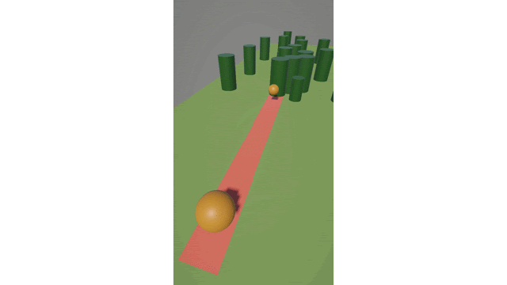

# Ball Shooter Prototype

A small gameplay prototype where the player controls a ball that shoots smaller balls to destroy obstacles and reach the goal.

## Technologies
- Unity 6.0 (6000.0.51f1)
- Zenject (Dependency Injection)

## Features
- Physics-based movement and shooting
- Projectile system with extensible architecture
- Size-dependent mechanics (player/projectiles interaction)
- Modular design for easy feature expansion

## How to Run

1. Open the project in Unity Hub
2. Use Unity version: 6000.0.x (most likely will work on higher versions)
3. Open scene called "SampleScene"

## Controls

Shooting: LMB/Mobile screen tap hold+release

## Architecture Notes

- Uses **Zenject** for dependency injection
- Systems are decoupled and modular
- Easy to add:
- new projectile types
- new obstacle behaviors
- Designed for rapid prototyping and scalability

## Feature Demo:

[Video](https://drive.google.com/file/d/1llKOqJPvDalYtQc1adPATlk17-O3umfq/view?usp=sharing)
